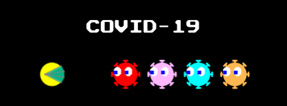
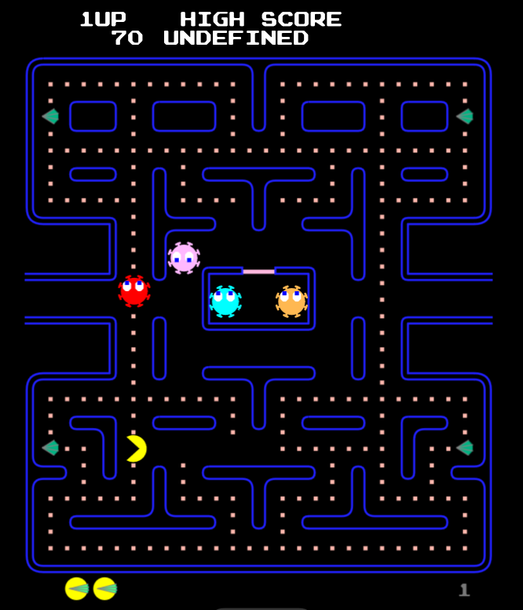

Pac-Man with Covid-19 Game Mode
=======

This is based on the great work of Shaun Williams (https://github.com/masonicGIT/pacman).
It extends the original versions with a Covid-19 mode.

Play Pac-Man in the Covid-19 version and try to stay away from the viruses.

Collect milk, rice, noodles and toilet paper for additional points.

If Pac-Man collects one of the masks it gets immune for a short time an is able to kill the viruses.

License
-------

This program is free software: you can redistribute it and/or modify
it under the terms of the **GNU General Public License Version 3** as 
published by the Free Software Foundation.

Play
----

You can play the game on all canvas-enabled browsers.  **Touch controls** are
enabled for mobile browsers.  The game is **resolution-independent** and smoothly scales to
fit the size of any screen.  **Performance** may increase by shrinking the window or zooming in with your browser.

### Main Controls

- **swipe**: steer pacman on mobile browsers
- **arrows**: steer pacman
- **end**: pause the game
- **escape**: open in-game menu

### Confirmed Desktop Browers

- Safari
- Firefox
- Chrome

### Confirmed Mobile Devices

- [iPad and iPhone (Mobile Safari)](http://www.atariage.com/forums/topic/202594-html5-pac-man/)
- Samsung Galaxy Tablet 7 (Firefox Beta)
- Nexus 7 (Chrome)

### Turbo Mode

Each game has an alternate mode called Turbo (a.k.a. speedy mode).  This is a
popular hardware modification of the game found in many of the original arcade
cabinets.  In this mode, Pac-Man travels about twice as fast (same speed as the disembodied eyes of the
ghosts) and is not slowed down when eating pellets.

### High Scores

High scores for each game (normal and turbo separately) are stored on your local machine by your browser.

Learn Mode
----------

Learn Mode allows you to visualize the behaviors of the ghosts.  (The colored square represents the ghost bait.)

![Learn][2]

Practice Mode
-------------

This mode allows you to practice the game with special features.  You can go
into **slow-motion** or **rewind time** with the special onscreen buttons or the hotkeys listed below.  (The time-manipulation controls and design were borrowed from the game [Braid](http://braid-game.com/)).  You can also turn on **invincibility** or **ghost visualizers** from the menu.

![Practice][3]

### Practice Controls

- **shift**: hold down to rewind (a la Braid)
- **1**: hold down to slow down the game to 0.5x
- **2**: hold down to slow down the game to 0.25x
- **o**: toggle pacman turbo mode
- **p**: toggle pacman attract mode (autoplay)
- **i**: toggle pacman invincibility
- **n**: go to next level
- **q,w,e,r,t**: toggle target graphic for blinky, pinky, inky, clyde, and pacman, respectively.
- **a,s,d,f,g**: toggle path graphic for blinky, pinky, inky, clyde, and pacman, respectively.

Procedurally-Generated Maps
---------------------------

In the **Cookie-Man** game mode, the mazes change as often as they do in Ms. Pac-Man, but are **procedurally generated**.  Each level has a pre-defined color palette, granting an element of consistency to the random structure of the mazes.

![Procedural][4]

### Algorithm Description

The mazes are built carefully to closely match design patterns deduced from the original maps found in Pac-Man and Ms. Pac-Man.

Accuracy
--------

It is a goal of this project to stay reasonably accurate to the original
arcade game. The current accuracy is due to the work of reverse-engineers Jamey Pittman and Bart Grantham.

Currently, the coordinate space, movement physics, ghost behavior, actor speeds, timers, and update rate match that of the original arcade game.

### Inaccuracies

The **timings** of certain non-critical events such as score display pauses and map-blinking animations are currently approximated.

Unfortunately, you **cannot use patterns from the original Pac-Man** because of complications with random number generators.

Also, the **collision detection** is tighter than the original (checked twice as often) to prevent pass-through "bugs".

I also chose to leave out the **overflow bug** which shifts a ghost target when Pac-Man is facing up, [detailed here](http://donhodges.com/pacman_pinky_explanation.htm).

### Report/Fix Bugs

Feel free to report any inaccuracies that may detract or simply annoy.  Any reverse-engineers willing to contribute their expertise to this project would be a big help as well!

Navigating the Repository
-------------------------
- all javascript source files are located in the "src/" directory
- "build.sh" file concatenates all the source files into "pacman.js" in the top directory
- "debug.htm" displays the game by using the "src/*.js" files
- "index.htm" displays the game by using the "pacman.js" file only
- the "fruit" directory contains notes and diagrams on Ms. Pac-Man fruit paths
- the "mapgen" directory contains notes, diagrams, and experiments on procedural Pac-Man maze generation
- the "sprites" directory contains references sprite sheets and an atlas viewer "atlas.htm" for viewing the scalable game sprites.
- the "font" directory contains font resources used in the game.

Credits
-------

### Reverse-Engineers

Thanks to **Jamey Pittman** for compiling [The Pac-Man Dossier](http://home.comcast.net/~jpittman2/pacman/pacmandossier.html) from his own research and those of other reverse-engineers, notably 'Dav' and 'JamieVegas' from [this Atari Age forum thread](http://www.atariage.com/forums/topic/68707-pac-man-ghost-ai-question/).  Further thanks to Jamey Pittman for replying to my arcade implementation-specific questions with some very elaborate details to meet the accuracy requirements of this project.

Thanks to **Bart Grantham** for sharing his expert knowledge on Ms. Pac-Man's internals, providing me with an annotated disassembly and notes on how fruit paths work in meticulous detail.

### Original Games

Thanks to the original Pac-Man team at Namco for creating such an enduring game.  And thanks to the MAME team for their arcade emulator and very helpful debugger.

Thanks to the Ms. Pac-Man team at GCC for improving Pac-Man with a variety of aesthetic maps that I based the map generator on.

Thanks to Jonathan Blow for creating the rewind mechanic in [Braid](http://braid-game.com) which inspired the same mechanic in my project.  Further thanks for presenting the implementation details in [this talk](https://store.cmpgame.com/product/5900/The-Implementation-of-Rewind-in-braid) which helped in my own implementation.

### Art

Thanks to Tang Yongfa and their cookie monster Pac-Man design at [threadless website](http://www.threadless.com/product/2362/Cookies) which I used as the character in the random maze mode.

Links to Public Feedback
------------------------

- http://www.reddit.com/r/programming/comments/z0tuv/historical_tribute_and_accurate_remake_of_the/
- http://www.reddit.com/r/javascript/comments/z7bc0/very_polished_javascript_remake_of_pac_man/
- http://www.reddit.com/r/webdev/comments/z85lj/quite_accurate_remake_of_pacman_in_js/
- http://news.ycombinator.com/item?id=4448539
- http://news.ycombinator.com/item?id=4464006
- http://www.lockergnome.com/news/2012/09/02/play-pac-man-online-for-free-no-download/
- http://www.atariage.com/forums/topic/202594-html5-pac-man/
- http://boards.straightdope.com/sdmb/showthread.php?t=664081
- http://www.classicarcadegaming.com/forums/index.php?topic=4563.0
- http://news.dice.com/2012/09/04/pac-man-online-open-source/

[1]: https://bitbucket.org/shaunew/pac-man/raw/4714800233a9/shots/montage2.png
[2]: https://bitbucket.org/shaunew/pac-man/raw/4714800233a9/shots/learn.png
[3]: https://bitbucket.org/shaunew/pac-man/raw/4714800233a9/shots/practice.png
[4]: https://bitbucket.org/shaunew/pac-man/raw/4714800233a9/shots/procedural.png
